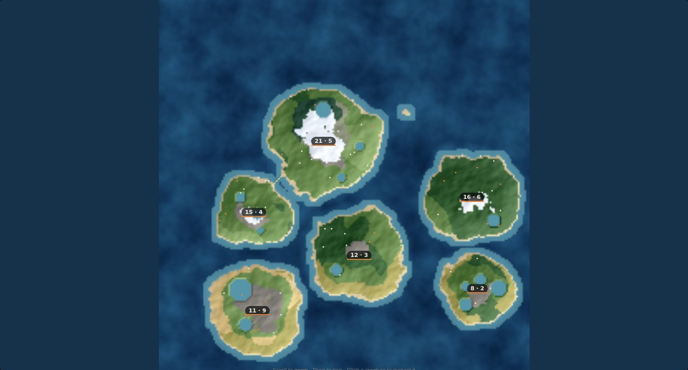
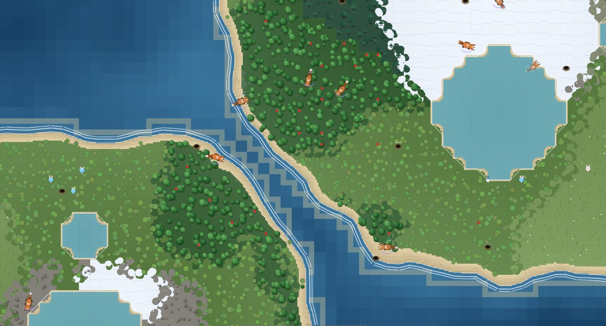

# Big worlds, islands, biomes, and migration — implementation plan

> "Can you make the map generator create much bigger maps with multiple
> islands. we want to also add some different biomes. the swim skill is really
> really developed would allow populations to migrate but only between very
> close lands. what would the zoomed out view show. allow big and small maps so
> it can play like today and big maps to enable the population separation."

Five requests that are really one: the world needs to be able to hold more than
one population, the ground under those populations needs to differ, water needs
to be able to separate them, a very developed swim gene needs to be the one
thing that reunites them — and a world that big needs a view that can show all
of it at once.

*The atlas view of a 224×224 world: five separate island groups, one swimmable channel (top left), and who is living where.*

## The problem

**One island, one population.** `generateMap` applied a single radial falloff
centred on the map, so every world was one landmass with one gene pool on it.
Nothing could diverge, because nothing was ever apart.

**One climate.** Moisture alone chose between grass, scrub and forest, so every
island looked like every other island and terrain only ever meant "there is
more cover here". Two islands would have been the same island twice.

**The sea was scenery.** `isPlaceable` refused the ocean to everything, always.
Water could stop a fox at a lake shore, but it could never be a *frontier* —
somewhere a lineage might cross, at a price, if it had earned it.

**Zoomed out was just smaller.** The renderer drew the same per-tile detail at
any zoom. At three pixels a tile that is fifty thousand fill calls a frame to
produce a blur.

## Decisions

| Question | Decision |
|---|---|
| Bigger maps, or many maps? | **Bigger, up to 224×224** (from a 140 ceiling), with the island count as its own setting. Size and island count move together in four presets, because a 64-tile map has nowhere to put a second island and a 224-tile map with one island on it is mostly sea. |
| Does it still play like today? | **Yes, by default.** `minIslands`/`maxIslands` default to 1 and size to 64, so a fresh install generates the world it always did. Everything below is opt-in from Settings. |
| How are several islands generated? | **One falloff per island**, radius scaled by `1/sqrt(count)` so the world's land is shared out rather than growing without limit, plus a low-frequency warp on the distance so nothing comes out a disc. A single island is centred with radius `size/2` — arithmetically identical to the old falloff. |
| How do islands end up close enough to matter? | **Deliberately.** Left to chance, near misses in open water are rare, so a new island has a 55% chance of being placed against an existing one with a 1–6 tile channel between their *coasts* (~0.9 R, not R — spacing islands by their radii merges them). |
| What decides a biome? | **Altitude, moisture and temperature**, in `worldgen/biomes.js`. Temperature is the new field: a north-south band scaled by a `climate` setting, a regional wobble, and a lapse with altitude. At climate 0 the whole world is one temperate band and biomes come from moisture alone — the old behaviour, still reachable from the slider. |
| Altitude relative to what? | **The island's own summit**, not the world's. Elevation is normalized map-wide, so on an archipelago every island but the tallest sat at the bottom of that range and came out as one flat sheet of beach. A floor (`MIN_ISLAND_RELIEF`) keeps a genuine sandbar sandy. |
| What do biomes *do*? | Two things the sim reads: **cover** (forest, taiga, marsh — a fox sees less far and scent lingers less) and **fruit** (the share of tiles that can bear an apple: forest 10%, taiga 5%, marsh 4%, savanna 3%, scrub 1.5%, everything else nothing). Desert, tundra, rock and snow are places to cross, not to live. |
| Can a strong swimmer cross the ocean? | **Only the shelf.** Sea within `SHALLOW_TILES` (3) of any coast is swimmable; deep water is refused to everything, forever. So two islands are reachable exactly when their shelves meet — a channel of six tiles or less. The rule is terrain, not a tuned probability. |
| How good does a swimmer have to be? | `OPEN_WATER_MIN_SKILL = 0.72`, against `SWIM_MIN_SKILL = 0.35` for a lake. Far above both species' founder means (0.28 and 0.22) and above where a lineage that merely uses lakes settles: crossing is something a warren *arrives at*, over generations, not something it starts with. |
| Does a crossing cost anything? | **Yes** — `OCEAN_DRAIN_FACTOR` (1.35×) on top of the usual swim drain. A migration is a gamble with a lineage's energy. |
| What does the zoomed-out view show? | **A different map, not a smaller one** (see below). |

## Islands and the water between them (`worldgen/islands.js`)

Two pure functions over the tile grid:

- `labelIslands` — 8-connected flood fill (a diagonal step is a step, because
  that is how creatures move), giving every landmass an id, an area and a
  centroid, plus a `landId` per tile that the sim uses to answer "which island
  is this rabbit on".
- `analyseWaters` — a multi-source BFS out from every coast gives each ocean
  tile its distance to land and which island that land belongs to. Tiles within
  `SHALLOW_TILES` are the shelf; a flood fill over the shelf unions every island
  touching the same stretch of it. That union *is* the migration graph:
  `groupCount` is how many separate worlds this world actually is, and a strait
  is recorded where two shelves meet, with the width of the water between them.

Islands connected only through a third are still one group, so island-hopping
works without ever crossing a channel that is too wide.

## Migration (`sim/water.js`)

`canEnterTile(map, x, y, ability, fromWater)` is now the single gate both
species use:

| Tile | Rule |
|---|---|
| Land | Always |
| Lake | `canSwim` (0.35) |
| Shelf | `canCrossOpenWater` (0.72) |
| Deep sea | Never, for anything |

`fromWater` is the one exemption, and it is about not building traps: something
already out of its depth has to be able to move through water to reach a bank.
A map with no `shallow` array (the hand-built ones in the tests) reads as "no
crossable sea anywhere", i.e. exactly the old behaviour.

## The atlas (`worldgen/mapgen.js`, `sim/render.js`)

Below `ATLAS_TILE_PX` (6 px/tile) on a world of `ATLAS_MIN_WORLD` (96) tiles or
more, the map is drawn as an atlas instead:

- Terrain is painted **once per map** into an offscreen image at one pixel per
  tile — biome colour plus a north-west hillshade — and blitted scaled. Panning
  a 224-tile world costs one `drawImage` a frame rather than 50,000 fills.
- Ocean is depth-shaded, and **the shelf is painted as a pale halo** around
  every coast. That halo is the migration map: where two halos touch, something
  with the gene can cross; where dark water meets, nothing can.
- Every crossable channel gets a **dashed marker** across it.
- Creatures become dots, and every settled island carries a live 🐇/🦊 tally
  (`islandPopulations`) — which is the whole point of a big world: two islands
  with different numbers on them are two populations.

Small worlds are untouched: a 64-tile island on a phone still shows real
creatures on real terrain at fit zoom, because swapping that for an overview
would be a regression rather than a feature.

*The same generator zoomed in. Biome boundaries are ragged rather than square (see `drawBiomeEdge`), and the two islands here are close enough for a strong swimmer to cross.*

## Balance

`make ecosystem` over 20 seeded islands, before and after (different terrain,
so this compares *worlds*, not just mechanics):

| | rabbits left | rabbit extinctions | both alive | kills |
|---|---|---|---|---|
| Before | 6.8 | 1/20 | 19/20 | 23.4 |
| After | 9.7 | 5/20 | 15/20 | 23.9 |

Biomes make outcomes more polarised: a warren on a wooded island does better
than it used to, and one that starts in the savanna-and-tundra half of a poor
island can fail outright. Food overall went slightly *up* (2.5% → 3.0% of land
can bear fruit) and cover with it, so this is terrain variance rather than a
squeeze — scrub and savanna were given a sparse fruit share (1.5% / 3%) after a
first pass where the open biomes were dead ground and kills fell noticeably.

One incidental fix came out of the same runs: a newborn was placed on any
non-ocean neighbour, lake included, so a shoreline warren lost a slice of every
generation to drowning — and a world with a lake on every island made that
obvious. Births now prefer dry land, falling back to water only for a parent
that is itself swimming.

## What this does not do

- **No movement cost per biome.** Snow and marsh look different but walk the
  same as grass; there is no terrain speed system to hang it on.
- **No sea current, weather or seasons.** Temperature is a fixed field, not a
  cycle.
- **Nothing steers a creature toward a crossing.** A migration happens because a
  strong swimmer's search heading pointed out to sea, or because it was fleeing.
  There is no "wanderlust" drive — which is why crossings look like an accident
  that stuck, rather than a decision.
