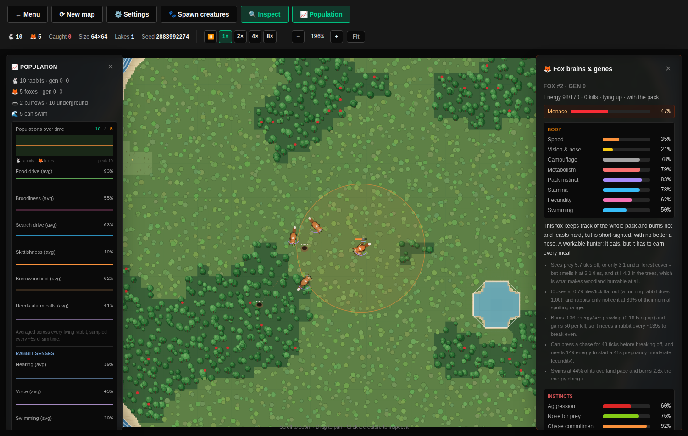
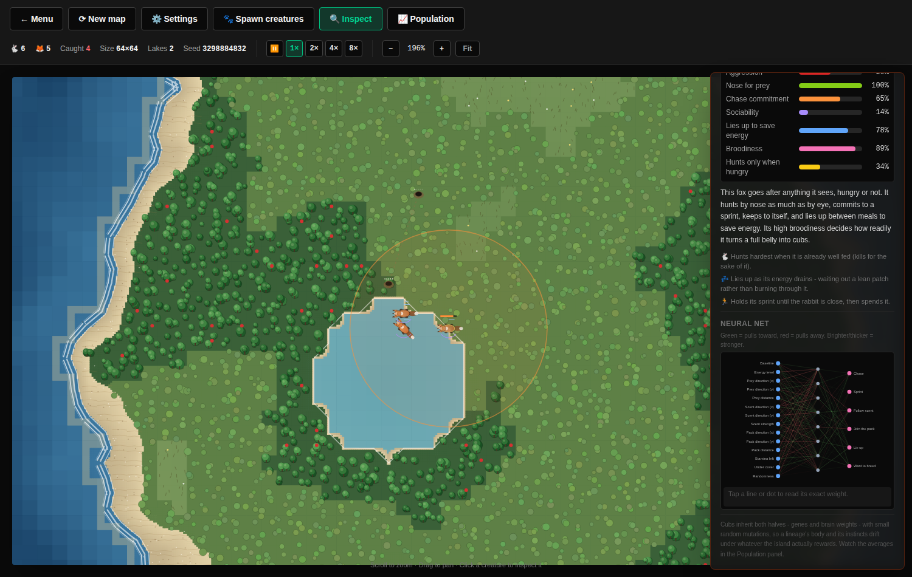

# Fox neural nets, fox survival, and a predator/prey cycle that actually cycles

> "I want to see the foxes neural nets. I also want the foxes to be able to
> survive a bit longer without food and a shorter average gestation period.
> Make sure that mutations work and we get some interesting dynamics. At the
> moment 5 rabbits and five foxes always result in the foxes dying out (I was
> mainly doing scatter)."

Three asks, and the third is the one that shapes everything else: a fox with
a brain is only interesting if there are still foxes alive to watch.

## The problem, measured

`scripts/ecosystem.mjs` runs the real simulation headlessly across a batch of
seeded islands. Both columns below are the *same twenty islands* — every run
seeds `Math.random`, which the map generator and the sim both draw from, so
the two configurations are compared on identical worlds rather than on the
luck of the map.

**5 rabbits + 5 foxes scattered, 64×64, 15 sim-minutes, 20 seeds**

| | rabbits left | rabbit extinctions | foxes left | fox extinctions | both alive at the end | rabbits caught |
|---|---|---|---|---|---|---|
| before | 39.8 | 0/20 | 0.0 | **20/20** | **0/20** | 2.6 |
| after | 6.8 | 1/20 | 3.8 | **0/20** | **19/20** | 23.4 |

**20 rabbits + 5 foxes, 20 sim-minutes, 24 seeds**

| | rabbits left | rabbit extinctions | foxes left | fox extinctions | both alive at the end | rabbits caught |
|---|---|---|---|---|---|---|
| before | 55.2 | 0/24 | 0.0 | 24/24 | 0/24 | 16.9 |
| after | 4.6 | 11/24 | 5.4 | **0/24** | **13/24** | 74.2 |

Before, the founder foxes starved within a few minutes having caught two or
three rabbits between them, and the rabbits then grew unopposed to forty or
fifty. That is not a predator/prey system; it is a stopwatch with a rabbit
population attached. Afterwards both species are usually still there at the
end, the fox line reaches its second and third generation, and the
populations visibly chase each other in the Population panel.

The heavier seeding is the honest weak spot: start the island with twenty
rabbits and about half the runs still end in the classic overshoot — more
rabbits, then more foxes, then a crash the prey does not come back from.
Fixing that properly needs a stronger prey refuge than burrows and woodland
currently provide, and it is the scenario to re-run first after any change
here.

Note the shape of the "after" column: rabbit numbers are *lower* and kills
are six times higher. That is the point — the rabbits are now being preyed
on rather than left alone.

## The neural net

A fox used to be a gene vector and a fixed if/else ladder: every fox on the
island hunted, regrouped and bred by the same script, and evolution could
only touch how fast its legs were. Now it has both halves, exactly like a
rabbit:

- **`src/sim/fox.js` — the body.** speed, vision & nose, camouflage,
  metabolism, pack instinct, stamina, fecundity. Still an explicit 0..1 gene
  vector you can read straight off the panel.
- **`src/sim/foxBrain.js` — the behaviour.** A 14 → 8 → 6 net, in the same
  shape and with the same mutation rules as a rabbit's.

| Decision | What it gates |
|---|---|
| `chase` | Commit to a rabbit it can see |
| `sprint` | Spend stamina to close, rather than trotting after it |
| `track` | Follow a scent to prey it cannot see |
| `group` | Close on a packmate while not hunting |
| `rest` | Lie up: no movement, upkeep drops to 45% |
| `breed` | Want a litter (still gated on the breed-energy threshold) |

`src/sim/net.js` is new: the feedforward maths both species' brains are built
from. Two hand-rolled copies of gaussian mutation would drift apart the first
time either was tuned, and "the foxes evolve differently because their
mutation code is a slightly different fork" is the least interesting reason a
simulation could produce different dynamics.

### Decisions

| Question | Decision |
|---|---|
| Does the fox keep its genes? | **Yes, minus `bloodlust`.** "How badly do I want to kill this rabbit" is an opinion, and opinions belong in the net where they can depend on hunger, range and whether the pack is there. The rest of the genome is hardware a weight matrix cannot express. |
| Why no `moveX`/`moveY` outputs? | Because the rabbit net already taught us that steering outputs fed by a mostly-constant input collapse into a frozen bearing (see `SEARCH_HEADING_TICKS` in `simulation.js`). The fox net decides *what to do*; `simulation.js` works out which way that points. |
| What stops founders being useless? | The same founder biases the rabbits use: fresh foxes start biased toward chasing, tracking and breeding. A pack that had to *discover* chasing rabbits starves before selection can reward the first one that tries. |
| Why do founders start biased toward **resting**? | It is the one negative-cost strategy available at minute zero, when there is nothing to find. An ambusher survives the opening; a fox that paces the island burns its reserves looking for prey that has not bred yet. A lineage evolves out of it when prey is thick. |
| How is a fox's decision made visible? | Trait bars, a blurb and the literal wiring in the inspector (`FoxInsights.jsx`), plus a "Fox instincts" trend section in the Population panel and two new map states: motes at the nose while tracking, sleep bars while lying up. |

### The nose

Sight tells a fox *where* a rabbit is; scent tells it roughly *which way to
walk*. Scent reaches about as far as the fox's eyes, but the bearing is
jittered in proportion to distance, and — unlike sight — it survives the
canopy (0.85 against `FOREST_VISION_FACTOR`'s 0.55). So woodland is where a
fox hunts by smell and open ground is where it hunts by eye.

A rabbit's scent scales with what it is doing: bolting leaves a hot trail,
sitting still barely registers, and underground leaves nothing at all. That
is the mirror image of how a sprinting fox gives itself away to a rabbit's
ears — and it means a jumpy lineage is easier to track, a cost skittishness
never used to pay.

A *longer* nose was tried (1.7× sight) and it ended the simulation: a pack
could find the last five rabbits on a 64×64 island, so the rabbits went
extinct in 15 of 20 runs and the foxes starved shortly after. It ended up
slightly *shorter* than sight (0.9×) once the swim gene landed — see below.

## The energy economy

| | before | after |
|---|---|---|
| Energy ceiling | 120 | **170** |
| Upkeep | 0.38–0.92/sec | **0.10–0.26/sec** (before the gene surcharge) |
| Upkeep lying up | — | **×0.45** |
| Energy per kill | 34–68 | **30–55** |
| Time from full to starvation (mid fox) | ~1.4 min | **~9 min prowling, ~20 lying up** |
| Gestation | 110s → 68s | **58s → 30s** |
| Breed threshold | 112 → 84 | **165 → 140** (of 170) |
| Cost of a litter | 22, cub starts at 70 | **110, cub starts at 60** |
| Vision surcharge | 0.30 × vision | **0.45 × vision** (it buys a nose now) |

The shape of this matters more than any single number. A fox is now a
**long-lived, low-throughput** animal: it can sit out a bad ten minutes, but
turning food into cubs is expensive, so its numbers answer a rabbit boom
slowly instead of instantly. Gestation got *shorter*, as asked — the brake is
energy and territory, not the clock.

## What stops the foxes eating the island bare

Making the foxes survivable is easy; making them survivable without them
exterminating the rabbits is the whole problem. Four mechanics do the work,
and every one of them was added because the ecosystem harness showed the run
collapsing without it:

1. **Territory** (`FOX_TERRITORY_RADIUS`, 24 tiles). A vixen will not raise
   cubs with another fox's scent that close to the den. This caps how many
   *breeding* foxes an island supports without capping how many can live on
   it — and it gives pack instinct a real cost, since foxes that hunt
   shoulder to shoulder cannot breed.
2. **Litter recovery** (`FOX_LITTER_RECOVERY_MS`, 150s). Without it a
   well-fed fox converts every second kill into another fox, and a rabbit
   boom becomes a fox boom inside two minutes. This was the single biggest
   improvement in the whole exercise: it took the 20-rabbit scenario from
   "rabbits extinct in 9 of 12 runs" to "both species alive in 10 of 12".
3. **A resting fox is quiet** (noise ×0.3, below even a feeding one). Foxes
   are a permanent presence now, and a rabbit that spends its life bolting
   never eats. An ambusher does not broadcast its position, so the warren
   around it carries on grazing.
4. **A burrow conserves energy** (`ENERGY_DEPLETE_SHELTERED_MS`, 2.2× slower
   than grazing). Rabbits now spend 30–60% of their lives underground; at the
   surface burn rate that was slow starvation for the entire warren, with the
   population dwindling without a single extra rabbit being caught.

There is also a **bug fix** that turned out to matter enormously: a sheltering
rabbit used to relay *second-hand* alarm calls. Two rabbits within earshot of
each other kept each other's alarm alive indefinitely, so a warren that went
to ground never heard an all-clear, never came up, and never ate. The surface
path had always been firsthand-only; the sheltered path now matches it.

## Rebasing onto the swim gene (#17)

This work was written against the island as it was before creatures could
swim, and #17 changed the terrain underneath it: below a swim skill of 0.35
a shoreline is now a *wall* rather than slow ground. For a fleeing rabbit
that is a much worse world — every lake edge is somewhere it can be pinned —
and against foxes that had just been made competent hunters, rabbit
extinctions in the headline scenario went from 5/20 to 9/20 on the merge
alone.

Two numbers absorbed it, both found with the harness on identical seeds:
the fox's nose came down from 1.0× its sight to **0.9×**, and the territory
radius went from 18 to **24** tiles. Same seeds, after: 1/20. The lesson is
the one the harness exists for — a balance change is only true of the
terrain it was measured on, and merging someone else's terrain change means
measuring again.

## Gating this

Unit tests pin mechanics; they cannot tell you whether the island still has
two species on it in ten minutes. Every balance change in this project has
been judged by a headless script run by hand — which means nothing was gated
on it, and a change that quietly reintroduced "the foxes always starve by
minute three" would have passed the entire suite.

So the script now lives in the repo (`scripts/ecosystem.mjs`, `make
ecosystem`), it is deterministic, and `src/sim/ecosystem.test.js` runs it in
CI. The assertions are deliberately loose — they guard against *collapse*
(one species reliably wiped out, evolution never reaching a second
generation), not against today's numbers, which are meant to move as the sim
gets richer.

Reproduce any run exactly with `npm run ecosystem -- --seed <n> --runs 1`.

## What starting conditions still decide

Deliberately, a lot. 5v5 is a knife-edge — the rabbits are extinct in a
quarter of runs and it is a genuinely open question which way an island goes,
which is what makes it worth watching. Heavier prey seeding produces the
classic overshoot: more rabbits, then more foxes, then a crash. That is the
system behaving like a predator/prey system rather than a scripted outcome,
and exposing those starting conditions to the player is the natural next
step.
